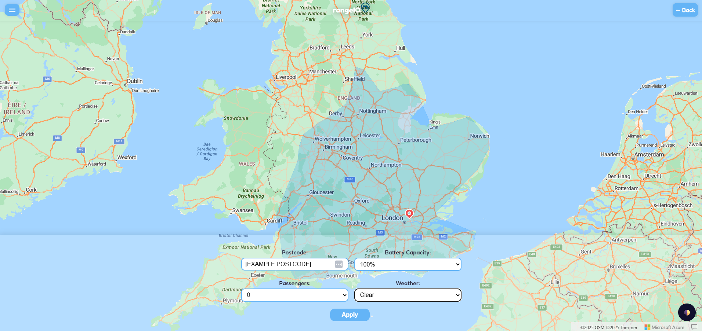

# Range IQ - the solution for range anxiety

## Overview

RangeIQ is a tool built for current and prospective EV owners, through which one can visualise the maximum range of an EV under a variety of travel conditions. The tool currently allows a user to compare four different popular EV models and their ranges depending on their start location, starting battery charge, number of passengers and weather conditions. Range is visualised as an [isodistance](https://www.geographyrealm.com/isodistance-isochrone-maps/) polygon, powered by [Azure Maps](https://azure.microsoft.com/en-us/products/azure-maps), which can be regenerated with the user reprompting the tool with a new starting location (a postcode), a new EV, or different travel conditions.

The app is designed with accessibility in mind, featuring a clean and simple UI that supports dark mode. While in its current condition the tool only supports comparison of four EVs, the underlying technology can support any number of EVs if provided a larger dataset (and with some minor reconfiguration of the select-vehicle.html).

This application was delivered as the final project of Group 1, Murati cohort, of the La Fosse Academy, consisting of:

- [Alex Bittman (PM)](https://github.com/abittmann)
- [Cass Naylor](https://github.com/Perspicacity11)
- [Olena Tabunshchyk](https://github.com/babussia)
- [Pritam Vekaria](https://github.com/Pritzstik)
- [Rafsanzani Ludhi](https://github.com/rafsanzi-ludhi)
- [Rupesh Mall](https://github.com/rmalldt)

## Navigating this repository

The root directory of this application is called 'group1-project'; this is unchanged from our initial deployment on 22-5-25 for the sake of consistency.

This tool is comprised of three microservices: the client, the server and the database. Each microservice has its own subdirectory containing its source code and unit tests, as well as a more granular README for that service. You should read these first, in addition to this document, before you begin working with or on the application - there are a number of environment variables to configure for the server, for example.

The root directory also contains the configuration code for Terraform IaC deployment using AWS infrastructure, as well as the Kubernetes manifests. Finally, the **cypress** subdirectory contains the files for our end-to-end tests, the configuration for which sits in the **cypress.config.js** file; you will see the script to run these tests in the root directory package.json.

The **python** subdirectory can be safely ignored, as it contains market research information presented alongside this app at the La Fosse Academy.

## Proper working state of the app

If all configuration is done correctly and without errors, the internal pages of the app will look like this:

## Contributing to the project

**1. Clone the repository:**

- Run `git clone https://github.com/rmalldt/group1-project.git`

**2. Open your `feature` branch based off the `main` branch:**

- Run `git checkout -b <my-feature>` from `main` branch.

- Work on individual branch and once happy with the changes, **add**, **commit** and **push** to your changes to your remote **feature** branch. Run `git push -u origin <my-feature>` to push your **feature** branch to Github.

  - Create a **PR** from your **feature** branch to the **main** branch.

  - One of the repo admins will then assess and (absent any issues) merge the **PR** to `main`.

  - Delete your **feature** branch if you think you do not need this branch in future.

**3. Switch back to `main` branch and always make sure to pull the latest changes:**

- Run `git checkout main` to switch to **development** branch.
- Run `git pull` to get the latest changes.
- To start new feature: Repeat **Step 2**

**4. If you are still working on `feature` branch and need latest changes from `development` branch:**

- Run `git stash save <"message">` to save the current unpushed changes in **feature** branch.
- Run `git checkout main` to switch to **main** branch.
- Run `git pull` to get the latest changes.
- Run `git checkout <my-feature>` to switch back to **feature** branch.
- Run `git merge main` to include the latest changes in your **feature** branch.
- Run `git stash pop stash@{0}` to apply the stash.

**NOTE**: We have defined rules protecting the main branch so it cannot be pushed to directly. It is important that you push changes to a remote branch and then open a pull request into the main branch, as pushing to the remote main branch from the local main branch will be blocked.